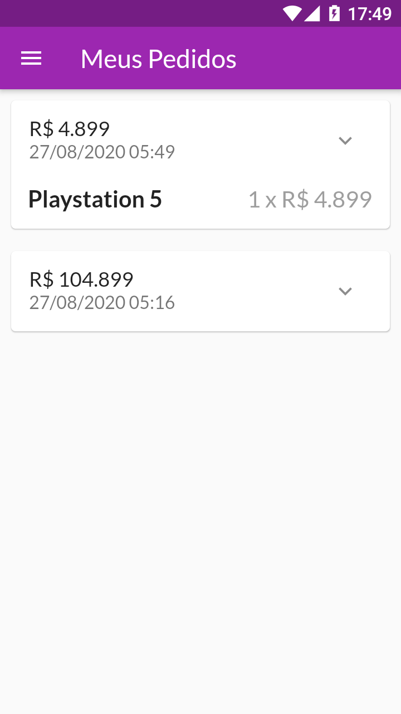

# shop

App de uma loja virtual feito como forma de atividade em um curso de Flutter. 

App com foco em :

- Gerenciamento de Estado utilizando o package Provider.

- Trabalho com formulários.

- Integração com o Backend(Firebase) com tratamento de erros personalizados.

- Autenticação de usuário com token via Firebase(Login com Email e Senha), tendo persistência de login, logout e logout automático(caso o token tenha expirado).

- Animações personalizadas: AnimatedBuilder, AnimatedContainer, Hero, Slivers e Custom Transitions.

OBS: Para utilizar esse projeto crie um arquivo constants.dart em /utils e dentro desse arquivo declarar a BASE_API_URL de sua API Firebase e a API_KEY do projeto Firebase.

## Screenshots

 
 
 
 
 
 
 
 
 
 
 
